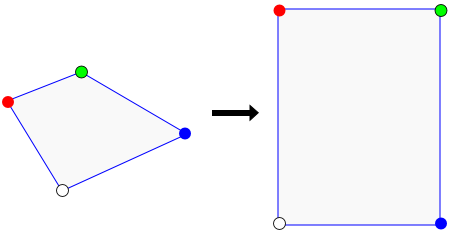
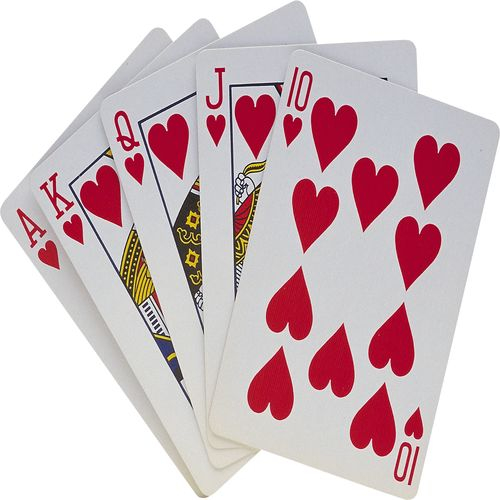
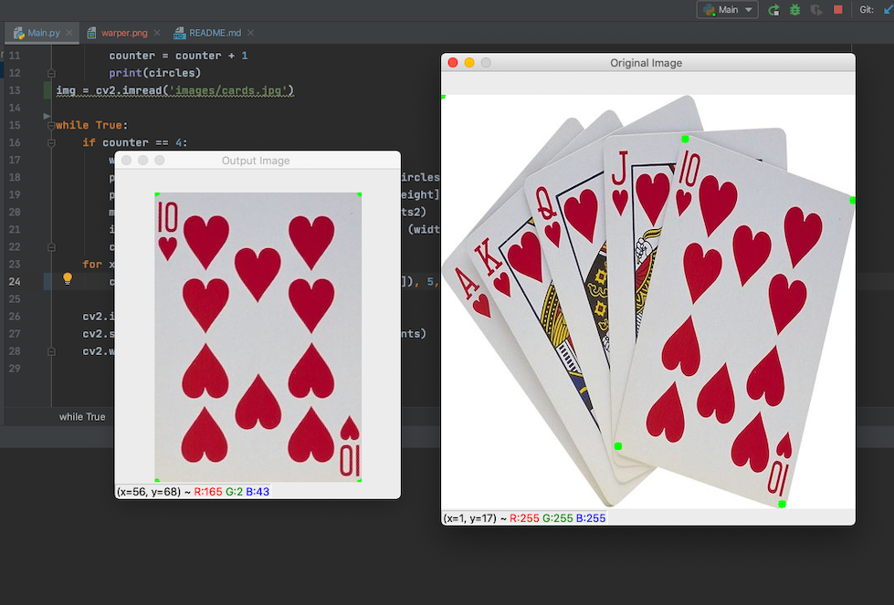

# How to wrap images by mouse clicking!
In this project I will  show how to use `warp perspective` function
 In openCV and transform images from to `angle 
 perspective` to a `bird view` like this:
 
 
 

## Explanation
###We are going to detect clicks on this image:


1. Importing libraries : cv2 and numpy.
2. Write standard openCV functions to read and show image.
``` python
import cv2
import numpy as np
img = cv2.imread('1.png')
cv2.imshow('Original Image',img)
cv2.waitkey(1)
```
In order to detect clicks we need 2 things:
- Function mousePoints (that will be called if the event(click) is received)
- Image which we should detect by clicking on

Then we want to implement our clicks

What we need to do is to store values (x,y) and count how many 
clicks have we actually performed.
For this we can define an array or a 
matrix (circles) where we need our points  and  each point has x ,y coordinates.

Next we need define our counter which is 0 (each time we click we will add to this counter ) so then:
``` python
counter = counter + 1
```
Store our counters in our circle matrix (in the row of the counter we add x,y value):
```python
circles[counter] = x,y 
```
This code is for warping the image to getting the bird view. Honestly, we need to perform this once we have all four points. We need to add a loop:
```python
while True:
    if counter == 4:
        width, height = 250, 350
        pts1 = np.float32([circles[0], circles[1], circles[2], circles[3]])
        pts2 = np.float32([[0, 0], [width, 0], [0, height], [width, height]])
        matrix = cv2.getPerspectiveTransform(pts1, pts2)
        imgOutput = cv2.warpPerspective(img, matrix, (width, height))
        cv2.imshow("Output Image ", imgOutput)
    for x in range(0, 4):
        cv2.circle(img, (circles[x][0], circles[x][1]), 3, (0, 255, 0), cv2.FILLED)

    cv2.imshow("Original Image ", img)
    cv2.setMouseCallback("Original Image ", mousePoints)
    cv2.waitKey(1)
```
In order to display our points since we are storing them in circles:
Every it goes from 0
```python
for x in range(0, 4):
    cv2.circle(img, (circles[x][0], circles[x][1]), 3, (0, 255, 0), cv2.FILLED)
```
##Result
###As you can see now we can easily get the bird view of any image we want:
 